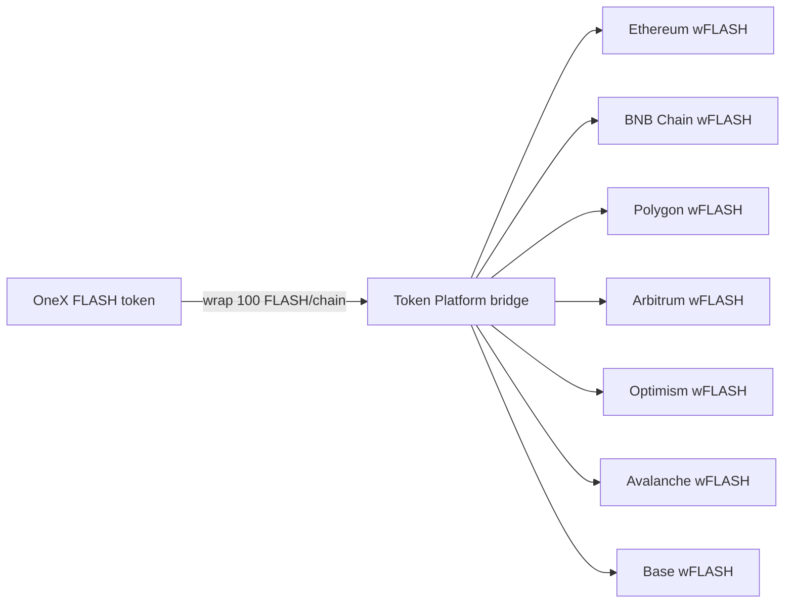

# Flash Coin — cross-chain mirror

Flash Coin (`FLASH`) is a OneX hub token mirrored as real ERC-20 `wFLASH` contracts on EVM mainnets.

## Architecture



| Layer | What it is |
|-------|------------|
| **Bridge mirror** | Off-chain wrap records + deterministic predicted EVM addresses |
| **Live deploy** | Real `FlashCoin.sol` contract creation on each chain |

Contract source: `contracts/FlashCoin.sol` (minimal ERC-20, constructor mint).

## Quick start

### 1. Build

```bat
go build -o bin/onex.exe ./cmd/onex
powershell -File scripts\compile-flashcoin.ps1
```

### 2. Generate bridge mirror (predicted addresses)

Requires `onex-bridge` at http://127.0.0.1:9338:

```bat
run-onex-wallet.bat
powershell -File scripts\generate-flash-coin-mirror.ps1
```

Or manually:

```bat
onex flash-coin-mirror -config configs/flash-coin-mirror.json
```

Output: `configs/flash-coin-mirror-result.json`

### 3. Live mainnet deploy (real addresses)

1. Copy `bsc-launcher/.env.example` → `bsc-launcher/.env`
2. Set `FLASH_DEPLOYER_PRIVATE_KEY=0x...` (or `BSC_DEPLOYER_PRIVATE_KEY`)
3. Fund that wallet with native gas on all mirror chains
4. Run:

```bat
scripts\deploy-flash-coin-live.ps1
```

Output: `configs/flash-coin-live-addresses.json`

Deploy is resumable — already-verified chains are skipped. Re-run after funding more chains.

### 4. Dashboard

Start Token Lab:

```bat
bsc-launcher\run-onex-token-lab.bat
```

Open http://127.0.0.1:9340/ → **Dashboard** → **Flash Coin mirrors**

- **PREDICTED** — deterministic address from bridge (not on-chain)
- **LIVE** — confirmed bytecode after `flash-coin-deploy-live`

## Configuration

`configs/flash-coin-mirror.json`:

| Field | Example | Notes |
|-------|---------|-------|
| `supply` | `"1000"` | Human decimals (not base units) |
| `wrapAmountPerChain` | `"100"` | wFLASH minted per live deploy |
| `mirrorChains` | 7 EVM mainnets | See `configs/chains.json` |

## CLI reference

```bat
onex flash-coin-mirror [-config PATH] [-bridge URL]
onex flash-coin-deploy-live [-config PATH] [-out PATH]
onex flash-coin-deploy-live -verify [-out PATH]
```

## One-shot finish script

```bat
powershell -File scripts\finish-flash-coin.ps1
```

Builds binaries, compiles contract, runs mirror if bridge is up, prints live-deploy instructions.
