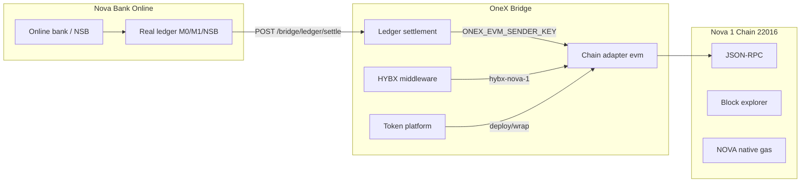

# CIS — Nova 1 Chain 22016 v1.0

**Component Integration Specification**

| Field | Value |
|-------|-------|
| Document ID | `CIS-NOVA-1-CHAIN-22016-v1` |
| Version | 1.0 |
| Status | Draft |
| Chain string ID | `nova-1` |
| Network ID (decimal) | **22016** |
| Network ID (hex) | `0x5600` |
| Chain type | `evm` (EVM-compatible) |
| Native symbol | `NOVA` |

---

## 1. Purpose and scope

This CIS defines how **Nova 1 Chain** (network ID **22016**) integrates with the OneX bridge, token platform, ledger settlement middleware, and Nova Bank Online.

**In scope**

- Chain registry entry and MetaMask network parameters
- JSON-RPC connectivity and explorer
- Ledger settlement: fiat → Nova 1 on-chain payout
- Token platform deploy and cross-chain wrap
- HYBX exchange route `hybx-nova-1`
- Environment and deployment contract

**Out of scope**

- Nova 1 consensus node operation (assumes external RPC operator)
- Smart contract audit
- Nova Bank Online account management (see `CIS-Nova-Bank-Online-v1.md`)

---

## 2. Network parameters

### 2.1 Chain registry (`configs/chains.json`)

```json
{
  "id": "nova-1",
  "name": "Nova 1 Chain",
  "networkId": 22016,
  "symbol": "NOVA",
  "native": false,
  "rpc": "https://rpc.nova1.chain",
  "explorer": "https://explorer.nova1.chain",
  "color": "#6b4ce6",
  "type": "evm"
}
```

### 2.2 MetaMask / wallet network table

| Field | Value |
|-------|-------|
| Network name | Nova 1 Chain |
| Chain ID | **22016** |
| Chain ID (hex) | `0x5600` |
| Currency symbol | NOVA |
| RPC URL | `https://rpc.nova1.chain` (replace with live endpoint) |
| Block explorer | `https://explorer.nova1.chain` |
| OneX string ID | `nova-1` |

### 2.3 Chain aliases (OneX bridge)

| Alias | Resolves to |
|-------|-------------|
| `nova` | `nova-1` |
| `nova-1` | `nova-1` |
| `nova1` | `nova-1` |
| `22016` | `nova-1` |
| `0x5600` | `nova-1` |

External destination format: `nova-1:0xRecipientAddress`

---

## 3. Architecture



---

## 4. Environment matrix

| Variable | Purpose | Example |
|----------|---------|---------|
| `ONEX_DEFAULT_BRIDGE_CHAIN` | Default ledger bridge target | `nova-1` |
| `NOVA1_RPC_URL` | Nova 1 JSON-RPC endpoint | `https://rpc.nova1.chain` |
| `NOVA1_EXPLORER` | Block explorer base URL | `https://explorer.nova1.chain` |
| `NOVA1_CHAIN_ID` | Decimal chain ID | `22016` |
| `ONEX_EVM_HOLDER` | Read-balance treasury address | `0x…` |
| `ONEX_EVM_SENDER_KEY` | Settlement signer (64-hex key) | `<private-key>` |
| `ONEX_LEDGER_MODE` | Ledger mode | `production` |
| `ONEX_API_KEY` | Bridge API authentication | `<secret>` |

Template: `deploy/env.nova-1-22016.example`

```env
ONEX_LEDGER_MODE=production
ONEX_DEFAULT_BRIDGE_CHAIN=nova-1
NOVA1_RPC_URL=https://rpc.nova1.chain
NOVA1_EXPLORER=https://explorer.nova1.chain
NOVA1_CHAIN_ID=22016
ONEX_EVM_HOLDER=0xYourNova1TreasuryAddress
# ONEX_EVM_SENDER_KEY=64hexPrivateKeyWithNOVAForGas
```

---

## 5. API contract

### 5.1 Ledger settlement (fiat → Nova 1)

**Endpoint:** `POST /bridge/ledger/settle`

```json
{
  "fromAccount": "nova-usd-checking",
  "amount": "500",
  "payoutAsset": "NOVA",
  "kind": "real_crypto",
  "externalTo": "nova-1:0xRecipientOnNova1Chain"
}
```

**Preview (no on-chain tx):**

```json
{
  "fromAccount": "m1-usd-checking",
  "amount": "100",
  "payoutAsset": "NOVA",
  "kind": "real_crypto",
  "externalTo": "nova-1:0x742d35Cc6634C0532925a3b844Bc9e7595f0bEb0",
  "preview": true
}
```

### 5.2 Ledger status

```bash
curl -s https://HOST/bridge/ledger/status | jq '.defaultBridgeChain'
# Expected: "nova-1"
```

### 5.3 Token platform

| Method | Path | Nova 1 usage |
|--------|------|--------------|
| GET | `/bridge/platform/status` | Platform health |
| POST | `/bridge/platform/deploy` | Deploy ERC-20 on Nova 1 |
| POST | `/bridge/platform/wrap` | Wrap to/from Nova 1 |
| GET | `/bridge/platform/tokens` | List tokens including Nova 1 |

**Deploy example:**

```json
POST /bridge/platform/deploy
{
  "name": "Nova Stable",
  "symbol": "NUSD",
  "supply": "1000000",
  "chain": "nova-1",
  "decimals": 18
}
```

### 5.4 HYBX exchange route

Add route `hybx-nova-1` to HYBX middleware config (`configs/hybx-middleware.example.json`):

```json
{
  "routes": [
    "nsb-hybx",
    "hybx-nova-1",
    "nova-1-hybx"
  ]
}
```

| Method | Endpoint | Purpose |
|--------|----------|---------|
| GET | `/bridge/bank/hybx/exchange/routes` | List routes including Nova 1 |
| POST | `/bridge/bank/hybx/exchange` | Exchange Nova Bank ↔ Nova 1 |

### 5.5 Production status

```bash
curl -s https://HOST/bridge/production/status | jq '.ledger.defaultBridgeChain'
```

---

## 6. JSON-RPC

Nova 1 Chain 22016 exposes standard EVM JSON-RPC. OneX uses the `evm` chain adapter.

| Method | Returns |
|--------|---------|
| `eth_chainId` | `0x5600` |
| `eth_blockNumber` | Latest block |
| `eth_getBalance` | NOVA balance |
| `eth_sendRawTransaction` | Settlement tx hash |

RPC resolution order:

1. `NOVA1_RPC_URL` environment variable
2. `configs/chains.json` → `nova-1.rpc` fallback

---

## 7. Security

| Control | Requirement |
|---------|-------------|
| Sender key | `ONEX_EVM_SENDER_KEY` — fund with NOVA for gas; never commit |
| Treasury holder | `ONEX_EVM_HOLDER` — read-only balance queries |
| RPC TLS | HTTPS required in production |
| Chain ID validation | Adapter must confirm `22016` before signing |

---

## 8. Deployment

Deploy guide: `deploy/DEPLOY-nova-1-22016.md`

### 8.1 Quick deploy

```bash
ssh ubuntu@YOUR_NOVA1_BRIDGE_SERVER
git clone https://github.com/zaragoza444/onex.git ~/onex
cd ~/onex
cp deploy/env.nova-1-22016.example /etc/onex/onex.env
# Edit ONEX_API_KEY, ONEX_EVM_SENDER_KEY, NOVA1_RPC_URL
sudo systemctl restart onex-bridge
```

### 8.2 Post-deploy verification

```bash
curl -s http://127.0.0.1:9338/bridge/ledger/status | jq '.defaultBridgeChain, .dbis138Configured'
curl -s http://127.0.0.1:9338/bridge/platform/status | jq .
```

Wallet: `http://HOST:9338/wallet/#ledger` → default bridge tab: **Nova 1 Chain**

### 8.3 Acceptance criteria

- `defaultBridgeChain` = `"nova-1"`
- `nova-1` appears in `configs/chains.json` and supported chains API
- Settlement preview succeeds for `externalTo: "nova-1:0x…"`
- Live settlement submits tx when sender key funded with NOVA
- Token deploy on `nova-1` returns contract address

---

## 9. Supported external destination examples

| Format | Example |
|--------|---------|
| Short | `nova-1:0x742d35Cc6634C0532925a3b844Bc9e7595f0bEb0` |
| Alias | `nova:0x742d35Cc6634C0532925a3b844Bc9e7595f0bEb0` |
| Chain prefix | `chain:nova-1:0x742d35Cc6634C0532925a3b844Bc9e7595f0bEb0` |

---

## 10. Related documents

| Document | Path |
|----------|------|
| Nova Bank Online CIS | `docs/cis/CIS-Nova-Bank-Online-v1.md` |
| Integration matrix | `docs/cis/CIS-Nova-Integration-Matrix-v1.md` |
| DBIS-138 pattern (reference) | `deploy/DEPLOY-dbis-138.md` |
| Token platform API | `docs/TOKEN-PLATFORM.md` |
| Chain registry | `configs/chains.json` |

---

*OneX / Nova 1 Chain 22016 — CIS v1.0*
