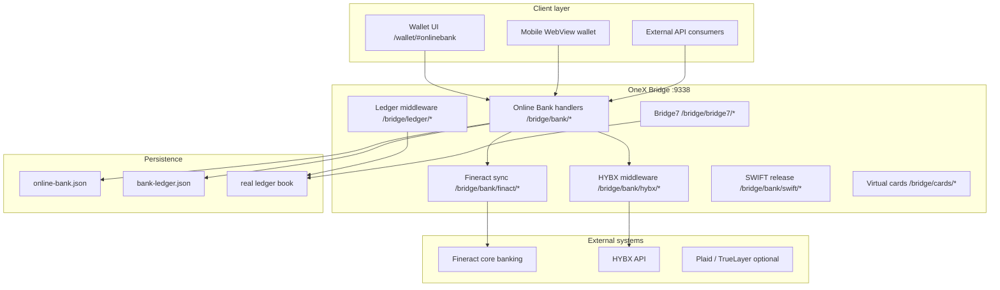

# CIS — Nova Bank Online v1.0

**Component Integration Specification**

| Field | Value |
|-------|-------|
| Document ID | `CIS-NOVA-BANK-ONLINE-v1` |
| Version | 1.0 |
| Status | Draft |
| Platform | OneX Bridge / NSB Online Banking |
| Customer brand | **Nova Bank Online** |
| Internal service | `onex-production-platform` / `onex-ledger-middleware` |

---

## 1. Purpose and scope

This CIS defines how **Nova Bank Online** integrates with the OneX production platform. Nova Bank Online is the customer-facing sovereign online banking brand; the underlying implementation is the OneX **NSB (National Sovereign Bank)** online bank module with IBAN accounts, fiat payment rails, core-banking sync, and HYBX exchange middleware.

**In scope**

- Online bank accounts, transfers, deposits, statements
- Fund classes M0, M1, NSB
- Payment rails: internal, IBAN, SEPA, SWIFT, wire, ACH, FPS
- Integrations: Fineract core banking, HYBX exchange, virtual cards, Bridge7 ledger, cash codes
- REST API contract on the OneX bridge (`:9338`)

**Out of scope**

- Nova 1 Chain settlement (see `CIS-Nova-1-Chain-22016-v1.md`)
- Mobile app store distribution
- Third-party KYC/AML vendor selection

---

## 2. System identifiers

| Identifier | Value |
|------------|-------|
| Bank display name | **Nova Bank Online** |
| Legal / ledger alias | NSB — National Sovereign Bank |
| SWIFT/BIC (default) | `NSBKLAL2X` |
| Bank ID (routing) | `nsb` |
| Fund class | `nsb` |
| Production domain (primary) | `onexproduction.com` |
| Trustee / alternate domain | `novatrustee.digital` |
| Bridge listen port | `9338` |
| Wallet UI path | `/wallet/#onlinebank` |

Nova Bank Online reuses the NSB ledger namespace. The persisted online-bank state (`~/.onex/online-bank.json`) may override `name` and `swift` for Nova branding at first seed.

---

## 3. Architecture



---

## 4. Environment matrix

| Environment | Host | Ledger mode | Online bank |
|-------------|------|-------------|-------------|
| Local dev | `127.0.0.1:9338` | `demo` | `ONEX_ONLINE_BANK=1` |
| Production | `onexproduction.com` | `production` | `ONEX_ONLINE_BANK=1` |
| Trustee | `novatrustee.digital` | `production` | `ONEX_ONLINE_BANK=1` |

### 4.1 Required environment variables

```env
ONEX_LEDGER_MODE=production
ONEX_ONLINE_BANK=1
ONEX_BANK_LEDGER_FILE=configs/bank-ledger.nova.example.json
ONEX_API_KEY=<long-random-secret>
ONEX_PRODUCTION_DOMAIN=onexproduction.com
ONEX_CORS_ORIGINS=https://onexproduction.com,https://novatrustee.digital
```

### 4.2 Optional integrations

```env
# HYBX exchange middleware
ONEX_HYBX_ENABLED=1
ONEX_HYBX_URL=https://api.hybrix.io

# Fineract core banking
ONEX_FINERACT_ENABLED=1
ONEX_FINERACT_URL=https://fineract.hybxfinance.com/fineract-provider
ONEX_FINERACT_TENANT=default
ONEX_FINERACT_USERNAME=<username>
ONEX_FINERACT_PASSWORD=<password>

# Bridge7 multi-ledger merge
ONEX_BRIDGE7_ENABLED=1
ONEX_BRIDGE7_PATHS_FILE=configs/bridge7.paths.json

# Cash codes + virtual cards
ONEX_CASHCODE_ENABLED=1

# Open banking providers (optional)
ONEX_BANK_PROVIDER=file
# ONEX_PLAID_CLIENT_ID=...
# ONEX_TRUELAYER_ACCESS_TOKEN=...
```

Full production template: `deploy/env.onexproduction.example`  
Nova trustee template: `deploy/env.novatrustee.digital.example`

---

## 5. Data models

### 5.1 Online bank account

| Field | Type | Description |
|-------|------|-------------|
| `id` | string | Account ID (e.g. `nova-usd-checking`) |
| `name` | string | Display name |
| `iban` | string | IBAN or Nova-format account number |
| `currency` | string | ISO 4217 (USD, EUR, GBP, …) |
| `balance` | string | Decimal balance |
| `fundClass` | string | `m0`, `m1`, `nsb` |
| `bank` | string | `nsb`, `nova`, `central` |
| `status` | string | Account status |

### 5.2 Transaction types

| `type` / `rail` | Description |
|-----------------|-------------|
| `internal` | Between Nova Bank accounts |
| `iban` | IBAN transfer |
| `sepa` | SEPA credit transfer |
| `swift` | SWIFT MT release |
| `wire` | Domestic wire |
| `ach` | ACH (US) |
| `fps` | Faster Payments (UK) |

### 5.3 Fund classes

| Class | Label | Use |
|-------|-------|-----|
| `m0` | M0 — base money | Central reserves, vault |
| `m1` | M1 — demand deposits | Checking, transactional |
| `nsb` | NSB / Nova sovereign | Sovereign reserve accounts |

Seed data: `configs/bank-ledger.nova.example.json`

---

## 6. API contract

Base URL: `https://<HOST>/bridge` (or `http://127.0.0.1:9338/bridge` locally)

Authentication: `X-API-Key: <ONEX_API_KEY>` on mutating endpoints where enforced.

### 6.1 Online bank core

| Method | Endpoint | Purpose |
|--------|----------|---------|
| GET | `/bridge/bank/status` | Bank health, provider, integrations |
| GET | `/bridge/bank/accounts` | List all accounts |
| GET | `/bridge/bank/account?id=` | Single account |
| GET | `/bridge/bank/transactions` | History (`?account=`, `?type=`, `?limit=`) |
| GET | `/bridge/bank/ledger` | Ledger snapshot by fund class |
| GET | `/bridge/bank/wire?account=` | Wire instructions |
| GET | `/bridge/bank/statement?account=` | CSV statement export |
| POST | `/bridge/bank/transfer` | Internal or IBAN transfer |
| POST | `/bridge/bank/send` | Alias for transfer |
| POST | `/bridge/bank/deposit` | Credit account |

### 6.2 Transfer request body

```json
{
  "fromAccount": "nova-usd-checking",
  "toAccount": "nova-eur-transactional",
  "amount": "1000.00",
  "rail": "internal",
  "toIban": "",
  "reference": "Nova transfer ref",
  "preview": false
}
```

### 6.3 Deposit request body

```json
{
  "toAccount": "nova-usd-sovereign",
  "amount": "5000.00",
  "source": "wire",
  "reference": "Incoming wire",
  "preview": false
}
```

### 6.4 HYBX exchange middleware

| Method | Endpoint | Purpose |
|--------|----------|---------|
| GET | `/bridge/bank/hybx/status` | HYBX client health |
| GET | `/bridge/bank/hybx/middleware/status` | Middleware status |
| GET | `/bridge/bank/hybx/exchange/routes` | Available exchange routes |
| GET | `/bridge/bank/hybx/exchange/quote` | Quote for pair |
| POST | `/bridge/bank/hybx/exchange` | Execute Nova ↔ HYBX ↔ chain exchange |
| POST | `/bridge/bank/hybx/settle` | Settle exchange to destination |

### 6.5 Fineract core banking

| Method | Endpoint | Purpose |
|--------|----------|---------|
| GET | `/bridge/bank/fineract/status` | Fineract connection |
| GET | `/bridge/bank/fineract/accounts` | Core banking accounts |
| POST | `/bridge/bank/fineract/sync` | Sync Fineract → Nova online bank |
| POST | `/bridge/bank/fineract/deposit` | Deposit via Fineract |
| POST | `/bridge/bank/fineract/withdraw` | Withdraw via Fineract |

### 6.6 SWIFT release

| Method | Endpoint | Purpose |
|--------|----------|---------|
| GET | `/bridge/bank/swift/status` | SWIFT system status |
| POST | `/bridge/bank/swift/release` | Release SWIFT payment |

### 6.7 Virtual cards

| Method | Endpoint | Purpose |
|--------|----------|---------|
| GET | `/bridge/cards/status` | Cards 101.1 status |
| POST | `/bridge/cards/issue` | Issue virtual card |
| POST | `/bridge/bank/hybx/cards/issue` | Issue via HYBX |

### 6.8 Production status (unified)

| Method | Endpoint | Purpose |
|--------|----------|---------|
| GET | `/bridge/production/status` | Full platform status + API map |
| GET | `/bridge/health/green` | Green health check |

---

## 7. Security and connectivity

| Control | Requirement |
|---------|-------------|
| TLS | Required in production (`novatrustee.digital`, `onexproduction.com`) |
| API key | `ONEX_API_KEY` — rotate on compromise |
| CORS | Restrict to approved origins via `ONEX_CORS_ORIGINS` |
| Bank ledger file | `0600` permissions; never commit live balances |
| Fineract credentials | Store in `.env` or `/etc/onex/onex.env` only |

---

## 8. Deployment

### 8.1 VPS deploy (production)

```bash
cd /opt/onex
git pull
cp deploy/env.onexproduction.example .env
# Edit ONEX_API_KEY, Fineract creds, bank ledger path
docker compose -f docker-compose.prod.yml up -d --build
```

Trustee deploy: `deploy/DEPLOY-novatrustee.digital.md`

### 8.2 Verification checklist

```bash
curl -s https://HOST/bridge/production/status | jq '.onlineBank'
curl -s https://HOST/bridge/bank/status | jq .
curl -s https://HOST/bridge/bank/accounts | jq '.count'
curl -s https://HOST/bridge/bank/ledger | jq '.byFundUsd'
```

**Acceptance criteria**

- `onlineBank.online` = `true`
- At least one Nova/NSB account seeded
- `hybxMiddleware.enabled` = `true` when HYBX configured
- `fineract.enabled` = `true` when Fineract configured
- Transfer preview returns `status: "ok"` without error

---

## 9. Cross-system flows

| Flow | Mechanism |
|------|-----------|
| Fiat deposit → ledger | `POST /bridge/bank/deposit` → Fineract sync |
| Nova → crypto payout | `POST /bridge/ledger/settle` with `externalTo: "nova-1:0x..."` |
| Nova ↔ HYBX mirror | `POST /bridge/bank/hybx/exchange` route `nsb-hybx` |
| Card spend → debit | Virtual card middleware debits online bank account |
| Multi-ledger merge | `POST /bridge/bridge7/sync` |

See `CIS-Nova-Integration-Matrix-v1.md` for Nova 1 Chain 22016 settlement paths.

---

## 10. Appendices

### A. Sample status response (abbreviated)

```json
{
  "name": "Nova Bank Online",
  "online": true,
  "swift": "NSBKLAL2X",
  "accounts": 6,
  "enabled": true,
  "provider": { "provider": "file" },
  "hybx": { "enabled": true },
  "fineract": { "enabled": true }
}
```

---

## 12. Payment Gateway (card acquiring)

Nova Bank Online includes an integrated **Payment Gateway** for Visa, Mastercard, and American Express via a certified acquirer/processor adapter (Stripe in production, mock in development).

| Item | Value |
|------|-------|
| Portal URL | `/payments/` (hosted on `onex-bridge`) |
| Framework | `nova` (default) or `zbank` |
| Config file | `configs/payment-gateway.example.json` |
| Flows | `donation`, `payment`, `collection` |
| Settlement | Internal Nova Bank accounts or external nominated banks (Wells Fargo, ANZ, Citibank, Lloyds, etc.) |

### 12.1 API routes

| Method | Path | Description |
|--------|------|-------------|
| GET | `/bridge/payments/status` | Gateway status |
| GET | `/bridge/payments/config` | Public config (framework, fees, Stripe publishable key) |
| GET | `/bridge/payments/pages` | Active hosted pages |
| GET | `/bridge/payments/page?slug=` | Single page config |
| POST | `/bridge/payments/session` | Create payment session |
| POST | `/bridge/payments/confirm` | Confirm payment (mock / post-3DS) |
| POST | `/bridge/payments/webhook` | Processor webhook (Stripe signature verified) |

### 12.2 Settlement routing

Each payment page references a `settlementDestination` ID. Destinations may be:

- **internal** — credit a Nova Bank Online ledger account immediately
- **external** — credit gateway clearing account; payout to nominated bank via acquiring settlement (subject to processor and regulatory rules)

Optional **processing fees** are configurable globally or per-page (`percent` + `fixed`).

### 12.3 Environment variables

| Variable | Purpose |
|----------|---------|
| `ONEX_PAYMENT_GATEWAY` | Enable gateway (`1`) |
| `ONEX_PAYMENT_GATEWAY_FILE` | Path to gateway config JSON |
| `ONEX_PAYMENT_GATEWAY_FRAMEWORK` | `nova` or `zbank` |
| `ONEX_PAYMENT_GATEWAY_PROVIDER` | `mock` or `stripe` |
| `ONEX_STRIPE_SECRET_KEY` | Stripe secret key |
| `ONEX_STRIPE_PUBLISHABLE_KEY` | Stripe publishable key |
| `ONEX_STRIPE_WEBHOOK_SECRET` | Stripe webhook signing secret |

---

### B. Related documents

| Document | Path |
|----------|------|
| Nova 1 Chain CIS | `docs/cis/CIS-Nova-1-Chain-22016-v1.md` |
| Integration matrix | `docs/cis/CIS-Nova-Integration-Matrix-v1.md` |
| Bridge7 handoff | `deploy/BRIDGE7-SHARE.md` |
| Production env | `deploy/env.onexproduction.example` |
| Bank ledger seed | `configs/bank-ledger.nova.example.json` |

### C. Error handling

| HTTP | Meaning |
|------|---------|
| 400 | Missing required field (`id`, `account`, malformed JSON) |
| 405 | Wrong HTTP method |
| 200 + `error` | Business logic failure (insufficient balance, unknown account) |

---

*OneX / Nova Bank Online — CIS v1.0*
