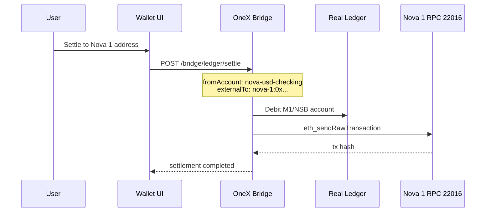

# CIS — Nova Integration Matrix v1.0

**Cross-system integration map: Nova Bank Online ↔ Nova 1 Chain 22016**

| Field | Value |
|-------|-------|
| Document ID | `CIS-NOVA-INTEGRATION-MATRIX-v1` |
| Version | 1.0 |
| Components | Nova Bank Online + Nova 1 Chain (22016) |

---

## 1. Component summary

| Component | CIS document | String ID | Key identifier |
|-----------|--------------|-----------|----------------|
| Nova Bank Online | `CIS-Nova-Bank-Online-v1.md` | `nsb` / `nova` | SWIFT `NSBKLAL2X` |
| Nova 1 Chain | `CIS-Nova-1-Chain-22016-v1.md` | `nova-1` | Chain ID **22016** (`0x5600`) |
| OneX Bridge | (platform) | `onex-production-platform` | Port `9338` |

---

## 2. Integration matrix

| # | Source | Target | Flow | API / mechanism | Settlement kind |
|---|--------|--------|------|-----------------|-----------------|
| 1 | Nova Bank account | Nova Bank account | Internal transfer | `POST /bridge/bank/transfer` | `internal` |
| 2 | Nova Bank M1 | External IBAN | SEPA / SWIFT / wire | `POST /bridge/bank/transfer` + `rail` | `real_fiat` |
| 3 | Nova Bank ledger | Nova 1 wallet | Fiat → NOVA payout | `POST /bridge/ledger/settle` | `real_crypto` |
| 4 | Nova 1 wallet | Nova Bank account | Crypto → fiat (via HYBX) | `POST /bridge/bank/hybx/exchange` | `hybx-nova-1` |
| 5 | Fineract core | Nova Bank Online | Account sync | `POST /bridge/bank/fineract/sync` | — |
| 6 | HYBX exchange | Nova Bank + Nova 1 | Multi-ledger routing | `POST /bridge/bank/hybx/exchange` | middleware |
| 7 | Bridge7 ledgers | Real ledger | Multi-book merge | `POST /bridge/bridge7/sync` | — |
| 8 | Virtual card spend | Nova Bank debit | Card authorization | `/bridge/cards/*` | internal debit |
| 9 | Token platform | Nova 1 ERC-20 | Deploy / wrap | `POST /bridge/platform/deploy` | on-chain |
| 10 | Nova Bank M0/M1/NSB | Liquidity pool | Fund class routing | Fiat settlement middleware | `vault` / pool |
| 11 | Card payer (Visa/MC/Amex) | Nominated bank account | Donation / payment / collection | `POST /bridge/payments/*` + `/payments/` portal | `internal` or `real_fiat` |

---

## 3. End-to-end flows

### 3.1 Nova Bank → Nova 1 Chain (fiat to crypto)



**Request:**

```json
POST /bridge/ledger/settle
{
  "fromAccount": "nova-usd-sovereign",
  "amount": "1000",
  "payoutAsset": "NOVA",
  "kind": "real_crypto",
  "externalTo": "nova-1:0xRecipientAddress"
}
```

### 3.2 Nova 1 → Nova Bank (crypto to fiat via HYBX)

```json
POST /bridge/bank/hybx/exchange
{
  "route": "nova-1-hybx",
  "from": "nova-1:0xSenderAddress",
  "to": "nova-usd-checking",
  "amount": "50",
  "asset": "NOVA"
}
```

### 3.3 Cross-chain wrap (Nova 1 ↔ other EVM chains)

```json
POST /bridge/platform/wrap
{
  "fromChain": "ethereum",
  "fromToken": "USDT",
  "toChain": "nova-1",
  "amount": "1000"
}
```

---

## 4. Shared configuration

Deploy both components on the same bridge instance:

```env
# Nova Bank Online
ONEX_LEDGER_MODE=production
ONEX_ONLINE_BANK=1
ONEX_BANK_LEDGER_FILE=configs/bank-ledger.nova.example.json
ONEX_HYBX_ENABLED=1
ONEX_FINERACT_ENABLED=1

# Nova 1 Chain 22016
ONEX_DEFAULT_BRIDGE_CHAIN=nova-1
NOVA1_RPC_URL=https://rpc.nova1.chain
NOVA1_CHAIN_ID=22016
ONEX_EVM_HOLDER=0xTreasuryOnNova1
# ONEX_EVM_SENDER_KEY=<funded-signer>

ONEX_API_KEY=<secret>
```

---

## 5. Unified verification

```bash
# Platform
curl -s https://HOST/bridge/production/status | jq '{onlineBank, defaultBridge: .ledger.defaultBridgeChain}'

# Nova Bank
curl -s https://HOST/bridge/bank/status | jq '{name, online, accounts: .accountCount}'

# Nova 1 Chain
curl -s https://HOST/bridge/ledger/status | jq '{defaultBridgeChain, nova1Rpc: .nova1Configured}'

# HYBX routes
curl -s https://HOST/bridge/bank/hybx/exchange/routes | jq .
```

---

## 6. Fund class routing (Nova Bank → settlement)

| Fund class | Typical source account | Nova 1 settlement |
|------------|------------------------|-------------------|
| `m0` | `nova-usd-cash` (reserves) | Routed via M1 pool before crypto payout |
| `m1` | `nova-usd-checking` | Direct `real_crypto` settlement |
| `nsb` | `nova-usd-sovereign` | Direct `real_crypto` settlement |

---

## 7. Document index

| Document | Path |
|----------|------|
| Nova Bank Online CIS | `docs/cis/CIS-Nova-Bank-Online-v1.md` |
| Nova 1 Chain 22016 CIS | `docs/cis/CIS-Nova-1-Chain-22016-v1.md` |
| Nova deploy (chain) | `deploy/DEPLOY-nova-1-22016.md` |
| Nova deploy (trustee) | `deploy/DEPLOY-novatrustee.digital.md` |
| Bank ledger seed | `configs/bank-ledger.nova.example.json` |
| Chain registry | `configs/chains.json` |
| HYBX middleware | `configs/hybx-middleware.example.json` |

---

*OneX / Nova Integration Matrix — CIS v1.0*
