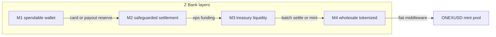

# CIS — Z Bank Online v1.0

**Component Integration Specification**

| Field | Value |
|-------|-------|
| Document ID | `CIS-Z-BANK-ONLINE-v1` |
| Version | 1.0 |
| Status | Draft |
| Platform | OneX Bridge / Online Banking |
| Customer brand | **Z Bank** |
| Internal service | `onex-production-platform` / `onex-ledger-middleware` |
| Peer brand | Nova Bank Online — see `CIS-Nova-Bank-Online-v1.md` (M0/M1/NSB; leave unchanged) |

---

## 1. Purpose and scope

This CIS defines how **Z Bank** uses the OneX production platform with an **internal M1–M4 fiat liquidity architecture**. These layers are Z Bank operational fund classes for wallets, safeguarded settlement, treasury, and wholesale/tokenized liquidity. They are **not** public macroeconomic money aggregates, and they are **not** account types advertised by Wise, Revolut, or other EMIs.

**In scope**

- Z Bank ledger seed accounts (M0 reserves + M1–M4 operational layers)
- Payment gateway framework `zbank` with settlement into Z Bank accounts
- Fund-class aliases shared with the ledger middleware
- REST API contract on the OneX bridge (`:9338`) when Z Bank env is active
- Corporate officer signatory auth (PIN + signature) — see `CIS-Z-Bank-DSSBOAT-Officer-v1.md`

**Out of scope**

- Changing Nova Bank seeds, CIS, or production defaults
- Full KYC/AML vendor selection
- Live SWIFT/SEPA scheme execution beyond existing rails wiring

---

## 2. System identifiers

| Identifier | Value |
|------------|-------|
| Bank display name | **Z Bank** |
| Payment gateway framework | `zbank` |
| Bank ID (routing / seed `bank`) | `zbank` |
| Bridge listen port | `9338` |
| Wallet UI path | `/wallet/#onlinebank` |
| Payments UI path | `/payments/` |

---

## 3. Operational fund classes (M1–M4)

| Class | Label | Z Bank meaning | Seed account examples |
|-------|-------|----------------|------------------------|
| `m0` | M0 — base reserves | Cash vault / central-style reserves (optional support layer) | `zbank-usd-cash` |
| `m1` | M1 — spendable wallet | Customer immediately spendable fiat (current / card balance) | `zbank-usd-checking`, `zbank-eur-checking` |
| `m2` | M2 — safeguarded settlement | Reserved / safeguarded balances awaiting payout or release | `zbank-usd-safeguarded` |
| `m3` | M3 — treasury liquidity | Treasury / liquidity pool for interbank or institutional ops | `zbank-usd-treasury` |
| `m4` | M4 — wholesale / tokenized | Cross-border settlement, tokenized fiat, wholesale liquidity | `zbank-usd-wholesale`, `zbank-gbp-wholesale` |

### 3.1 Alias compatibility

Ledger `NormalizeFundClass` keeps prior synonyms (`savings` → m2, `institutional` → m3, `money_market` → m4) and adds Z Bank operational aliases:

| Target | Aliases (non-exhaustive) |
|--------|---------------------------|
| `m2` | `safeguarded`, `settlement_reserve`, `reserved` (+ existing `savings`) |
| `m3` | `treasury`, `liquidity_pool` (+ existing `wholesale`, `institutional`) |
| `m4` | `cross_border`, `wholesale_liquidity`, `tokenized_fiat` (+ existing `money_market`, `repo`) |

### 3.2 Layer flow



Fiat settlement middleware continues to aggregate pools `pool:m1` … `pool:m4` and `pool:mint` (see ledger middleware). M0 source balances route into the M1 pool before aggregate settlement.

---

## 4. Data models

### 4.1 Online / bank ledger account

| Field | Type | Description |
|-------|------|-------------|
| `id` | string | Account ID (e.g. `zbank-usd-checking`) |
| `name` | string | Display name |
| `iban` | string | IBAN or Z Bank-format account number |
| `currency` | string | ISO 4217 |
| `balance` | string | Decimal balance |
| `fundClass` / `moneySupply` | string | `m0`, `m1`, `m2`, `m3`, `m4` |
| `bank` | string | `zbank` |

Seed data: `configs/bank-ledger.zbank.example.json`

### 4.2 Payment gateway settlement

Default gateway file: `configs/payment-gateway.zbank.example.json`

| Destination id | Internal accountId | Layer |
|----------------|--------------------|-------|
| `zbank-usd-main` | `zbank-usd-checking` | M1 |
| `zbank-usd-safeguarded` | `zbank-usd-safeguarded` | M2 |
| `zbank-usd-treasury` | `zbank-usd-treasury` | M3 |

Card **pay** pages settle to M1; **collect** pages settle to M2 (safeguarded). Do not settle Z Bank payments into Nova account IDs.

---

## 5. Environment

Template: `deploy/env.zbank.example`

```env
ONEX_LEDGER_MODE=production
ONEX_ONLINE_BANK=1
ONEX_BANK_LEDGER_FILE=configs/bank-ledger.zbank.example.json
ONEX_PAYMENT_GATEWAY=1
ONEX_PAYMENT_GATEWAY_FILE=configs/payment-gateway.zbank.example.json
ONEX_PAYMENT_GATEWAY_FRAMEWORK=zbank
ONEX_PAYMENT_GATEWAY_PROVIDER=mock
ONEX_API_KEY=<long-random-secret>
```

| Environment | Host | Notes |
|-------------|------|-------|
| Local dev | `127.0.0.1:9338` | Use zbank ledger + PG files above |
| Production | Operator-selected domain | Set `FRAMEWORK=zbank`; keep Nova production defaults on separate hosts |

---

## 6. API contract (shared bridge)

Base URL: `https://<HOST>/bridge` (or `http://127.0.0.1:9338/bridge` locally)

When Z Bank env is loaded, the same online-bank and ledger routes apply:

| Method | Endpoint | Purpose |
|--------|----------|---------|
| GET | `/bridge/bank/status` | Bank health |
| GET | `/bridge/bank/accounts` | List accounts (expect M1–M4 Z Bank IDs) |
| GET | `/bridge/ledger/status` | Middleware status including fund class labels |
| GET | `/bridge/bank/officer/status` | DSSBOaT / corporate officer store |
| POST | `/bridge/bank/officer/verify` | Verify officer PIN + signature |
| POST | `/bridge/bank/officer/transfer` | Officer-authorized transfer (PIN + signature) |
| POST | `/bridge/payments/*` | Card flows via Z Bank gateway |
| POST | `/bridge/ledger/middleware/fiat-settle` | Batch M1–M4 → mint aggregation |

Corporate officer CIS: `CIS-Z-Bank-DSSBOAT-Officer-v1.md`

Authentication: `X-API-Key: <ONEX_API_KEY>` on mutating endpoints where enforced.

---

## 7. Contrast with Nova Bank

| Topic | Nova Bank | Z Bank |
|-------|-----------|--------|
| CIS | `CIS-Nova-Bank-Online-v1.md` | This document |
| Ledger seed | `bank-ledger.nova.example.json` | `bank-ledger.zbank.example.json` |
| Fund model | M0 / M1 / NSB | M0 + M1–M4 operational layers |
| PG framework | `nova` | `zbank` |
| Settlement IDs | `nova-*` | `zbank-*` only |

Nova and Z Bank share the OneX bridge code path; switch brand via env and config files, not by mixing account IDs across brands.

---

## 8. Verify after deploy

```bash
curl -s https://HOST/bridge/bank/status | jq .
curl -s https://HOST/bridge/bank/accounts | jq .
curl -s https://HOST/bridge/ledger/status | jq '.fundClasses, .fundClassLabels'
curl -s https://HOST/payments/ | head
```

Expect ledger status to list `m0`–`m4` (and related classes) and bank accounts to include `zbank-usd-checking`, `zbank-usd-safeguarded`, `zbank-usd-treasury`, and wholesale (M4) IDs.
